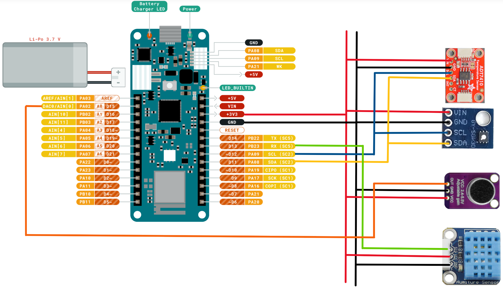

# Hardware Components
- Arduino MKR Wifi 1010
- Temperature sensor (ADT7410)
- Humidity sensor (sunfounder Humiture Sensor)
- CO2 sensor (GY-SGP40)
- Noise level sensor (GY-MAX4466)

# Circuit Plan

## Temperature & CO2 Sensor:
|Arduino|Temperature|
|---|---|
|VIN|VCC|
|GND|GND|
|SCL|SCL|
|SDA|SDA|

## Noise Level Sensor:
|Arduino|Temperature|
|---|---|
|A0|OUT|
|GND|GND|
|VCC|VCC|

## Noise Level Sensor:
|Arduino|Temperature|
|---|---|
|D13|SIG|
|VCC|VCC|
|GND|GND|

# Output format
Each sensor has a different unit of measurement. Therefore different datatypes are needed.

**1. Temperature**  
The temperature is measured in celcius (°C), the values are floats and can be negative.  
Unit: °C

**2. Humidity Sensor**  
The Humidity sensor returns values ranging from 0% to 100%, anything other is an invalid value.  
Unit: relative Humidity in %

**3. CO2 Sensor**  
The CO2 sensor is dependant on temperature and humidity. These values are needed to calculate the VOC-Index. 
The VOC-Index is ranging value from 0 to 500, any other value is invalid.  
Unit: VOC-Index

**4. Noise Level**  
The Noise sensor returns a analog value ranging from 0 to 1023. This value needs to be used to calculate a db value.  
Unit: integer

# Required Libraries
- Platform.ini holds all used Libraries
