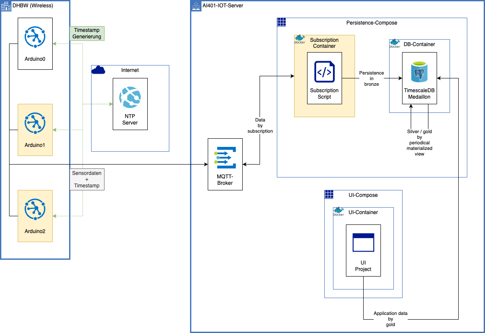

# Building Block View

The following picture shows the top-level decomposition of the DATENKRAKEN system. The picture mainly shows the infrastructure and data paths and their purpose. While all components are relevant for the final solution their position may change, based on their color within the picture. By default the shown components aren't supposed to move within the next iterations, except for yellow components. Those components are either not part of the bare mvp (arduino1, arduino2), or may move within the shown containers (subscription container). The decision making is primarly illustrated within chapter 4 and 9.

## DHBW (Wireless)
This container shows all physical devices, that communicate via a wireless connection (e.g. wifi) within the digitalcampus. Therefore it primarily shows arduinos (and later edge devices like esp32). Arduinos do communicate with a remote ntp server in order to being able to create timescape for their collected data points that are sent to the proper mqtt topic. For further information regarding the arduino setup take a look at <a href="/arduino/components">Chapter: Arduino Components</a>.

## AI401-IOT-Server
This container holds all components that are run within the IoT Server within the digitalcampus. Except for the mqtt broker those components are either a docker compose or (within a compose) docker containers. Containers within the compose are suppossed to communicate via the docker container network. Composes communicate via the internal linux network.

### Subscription Container
This container holds a script that primarly fetches new data from the mqtt broker in order to persist this data into the bronze layer of our used database.

### DB-Container
This container holds "TimescaleDB", a postgres database service with plugins for optimized timeseries handling. It's architecture is based on the medaillon architecture. Therefore it consists of a table for the bronze layer (raw data), and either a materialized view (periodically fetched) for the silver layer (cleaned, augmented) and gold layer (production ready data).

### UI-Container
This container isn't further specified yet. It's supposed to hold the code for the ui and host a webserver to access it.