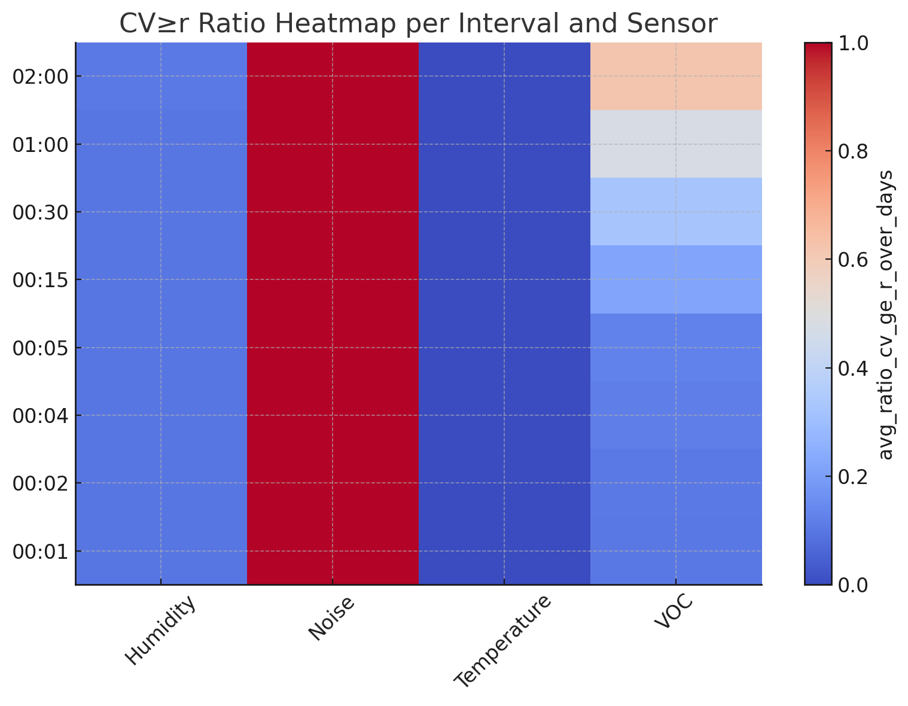

# Database
The following chapter describes our decision regarding our database. The database name used within the project is: datenkraken.

There are three users within the database:
**ui** -> read-only on gold schema
**dev** -> all privileges on tables within bronze, silver, gold except for delte
**datenkraken_admin** -> all

Configuration via .env:
```bash
POSTGRES_USER=
POSTGRES_PASSWORD=
UI_PASSWORD=
DEV_PASSWORD=
```
## Bronze
The bronze table has to store roughly 172k messages in the 60 days of our project period as discussed here <a href=""></a>. As specified the sensor data must be stored in the following fields (with additional fields of the <a href="/DATENKRAKEN/arduino/mqtt/">messageformat</a>).

Since we collect sensordata using different sample rates in order to be more memory efficient, we propose 4 tables in the bronze layer. Each stores the raw data of each sensor.

Fields that are part of all tables:

1. id: BIGSERIAL => used for composite primary key with the time field. => Composite primary key since this is the proposed way of timescaledb without inheriting any bottlenocks due to the index. (See down below: Best practices)

2. time: TIMESTAMPTZ

3. arduino_id: text -> denormalized since timescaledb does a dictionary compression / + enums do not allow to delete individual values within enum <a href="https://www.postgresql.org/docs/current/datatype-enum.html">8.7. Enumerated Types</a>

4. deleted_at: TIMESTAMPZ -> soft delete

Field per table:

1. temperature: float4 

2. humidity: smallint

3. voc: smallint

4. noise: smallint

This type of bronze layer definition is chosen due to the public recommendation by timescaledb. First we thought about storing all values for each 30 seconds intervall within an array. By that we can ensure to persist all data within one table. But we could not find any references that ensure, that this wouldn't lead to performance issues on data aggregation as it's common with the array type on relational databases.

Also if we would persist it within a single table (without arrays) we would introduce many null values. That would lead to a growth of memory space since timescaledb interprets a "Null" as actual value. <a href="https://www.tigerdata.com/blog/best-practices-for-picking-postgresql-data-types">Best Practices for Picking PostgreSQL Data Types</a>.

Therefore we chose a multiple table design as proposed in <a href="https://www.tigerdata.com/learn/best-practices-time-series-data-modeling-single-or-multiple-partitioned-tables-aka-hypertables">Best Practices for Time-Series Data Modeling: Single or Multiple Partitioned Table(s) a.k.a. Hypertables</a>

The tables are named in the following schema:

<b>bronze.SENSORTYPE</b>

### Bronze table size
In order to estimate the final size of the database we inserted 172k rows of realistic dummy data into the temperature table. And 5m rows in the noise table. By examining its relation and index size we wanted to make sure we dont run into future trouble. We found out that the biggest table within the 60 day period of our project would be the noise table with 341mb of memory usage.

_On ~172k temperature entries => 60min x 24h x 60days_
```
datenkraken=# SELECT pg_size_pretty(hypertable_size('bronze.temperature'));
 pg_size_pretty 
----------------
 106 MB
(1 row)
```

_On ~5m noise entries => 60min x 24h x 60days x 60 entries per minute_
```
datenkraken=# SELECT pg_size_pretty(hypertable_size('bronze.noise'));
 pg_size_pretty 
----------------
 341 MB (1 row)
```

Although this table size isn't very high we decided to create a composite index on the columns time and arduino_id in order to speed up read processes. We only need a composite index out of three reasons:

1. Our use case primarily will only need two filters within the dashboard -> in general by time (to scale diagrams), by time and arduino_id (to view each room). Therefore a composite index should be created.
2. Even if we filter only for time (for development purposes) timescale has a index on time by default.
3. Even if we filter only for arduino_id, we defined segments (partitions) for arduino_id on our hypertable definition.

When we want to detect bugs later on this could therefore help a lot, since in the worst case we had to trace it from gold to bronze layer and vice versa.

## Silver
The purpose of this layer is to create filtered and cleaned layer of data. We develop the layer definition by the typical data quality criterias:

1. **Accuracy** - How correct is the data values?
2. **Completeness** - Is all information present?
3. **Consistency** - Does the data match other trusted data sources? (Not checkable => Ignored) 
4. **Validity** - Does the data conform to the predetermined format & constraints?
5. **Timeliness** - How up-to-date is the data?
6. **Intergrity** - Is the data maintained & updates over time?
7. **Uniqueness** - How little duplication is there in the records?

### Accuracy & Validity
Since we don't have direct access to other data sources we check the datas accuracy and validity based on plausibility rule set. Therefore we examine the columns as following

1. values -> sorted by min, max  see if range is plausible + singular values -> see whether values are plausible
2. time -> sorted by min, max + singular values -> see whether formatting works right / if it needs to be cleaned / pruned

We used the following query to check those:

#### Values Min, Max Check
```sql
SELECT * FROM bronze.temperature ORDER BY values DESC LIMIT 50;
```
-> Check for min max values. (via desc, asc)

On first sight we have seen, that we have extreme outliers for bronze.voc. Where the common voc should be around 50 according to research we found many points lying in the region of around 100 - 300. When examining the data points via interval nesting of the ids we've seen that the outliers aren't actually "outliers" but the voc index is just pretty high in the morning. Therefore we wrote the following query, which looks for the min and max in a one hour interval per day:

```sql
SELECT time::date as Voc_Date, time_bucket('1 hours', time) as bucket, min(voc) as Voc_Minimum, max(voc) as Voc_Maximum
FROM bronze.voc
WHERE time::date = '2025-08-06'
GROUP BY Voc_Date, bucket
ORDER BY bucket ASC;
```

This produces the following output:

```
  voc_date  |         bucket         | voc_minimum | voc_maximum 
------------+------------------------+-------------+-------------
 2025-08-06 | 2025-08-06 00:00:00+02 |         212 |         263
 2025-08-06 | 2025-08-06 01:00:00+02 |         261 |         281
 2025-08-06 | 2025-08-06 02:00:00+02 |         279 |         296
 2025-08-06 | 2025-08-06 03:00:00+02 |         296 |         313
 2025-08-06 | 2025-08-06 04:00:00+02 |         313 |         325
 2025-08-06 | 2025-08-06 05:00:00+02 |         325 |         335
 2025-08-06 | 2025-08-06 06:00:00+02 |         118 |         337
 2025-08-06 | 2025-08-06 07:00:00+02 |          51 |         118
 2025-08-06 | 2025-08-06 08:00:00+02 |          44 |         265
 2025-08-06 | 2025-08-06 09:00:00+02 |          15 |         162
 2025-08-06 | 2025-08-06 10:00:00+02 |          21 |         110
 2025-08-06 | 2025-08-06 11:00:00+02 |          14 |          21
 2025-08-06 | 2025-08-06 12:00:00+02 |           3 |          40
 2025-08-06 | 2025-08-06 13:00:00+02 |           4 |          34
 2025-08-06 | 2025-08-06 14:00:00+02 |          15 |          34
 2025-08-06 | 2025-08-06 15:00:00+02 |          20 |          23
 2025-08-06 | 2025-08-06 16:00:00+02 |          18 |          30
 2025-08-06 | 2025-08-06 17:00:00+02 |          22 |          30
 2025-08-06 | 2025-08-06 18:00:00+02 |          29 |          35
 2025-08-06 | 2025-08-06 19:00:00+02 |          28 |          33
 2025-08-06 | 2025-08-06 20:00:00+02 |          27 |          46
 2025-08-06 | 2025-08-06 21:00:00+02 |          46 |          73
 2025-08-06 | 2025-08-06 22:00:00+02 |          73 |         100
 2025-08-06 | 2025-08-06 23:00:00+02 |         100 |         127
```

The following days show a similar output. BUT on weeknds the voc index stays permanently high, heres a sample of it:

```
  voc_date  |         bucket         | voc_minimum | voc_maximum 
------------+------------------------+-------------+-------------
 2025-08-09 | 2025-08-09 00:00:00+02 |         140 |         166
 2025-08-09 | 2025-08-09 01:00:00+02 |         166 |         199
 2025-08-09 | 2025-08-09 02:00:00+02 |         200 |         212
 2025-08-09 | 2025-08-09 03:00:00+02 |         212 |         226
 2025-08-09 | 2025-08-09 04:00:00+02 |         227 |         241
 2025-08-09 | 2025-08-09 05:00:00+02 |         241 |         248
 2025-08-09 | 2025-08-09 06:00:00+02 |         248 |         260
 2025-08-09 | 2025-08-09 07:00:00+02 |         260 |         266
 2025-08-09 | 2025-08-09 08:00:00+02 |         266 |         271
 2025-08-09 | 2025-08-09 09:00:00+02 |         260 |         271
 2025-08-09 | 2025-08-09 10:00:00+02 |         251 |         260
 2025-08-09 | 2025-08-09 11:00:00+02 |         251 |         251
 2025-08-09 | 2025-08-09 12:00:00+02 |         250 |         251
 2025-08-09 | 2025-08-09 13:00:00+02 |         251 |         251
 2025-08-09 | 2025-08-09 14:00:00+02 |         251 |         253
 2025-08-09 | 2025-08-09 15:00:00+02 |         253 |         253
 2025-08-09 | 2025-08-09 16:00:00+02 |         253 |         254
 2025-08-09 | 2025-08-09 17:00:00+02 |         253 |         254
 2025-08-09 | 2025-08-09 18:00:00+02 |         253 |         253
 2025-08-09 | 2025-08-09 19:00:00+02 |         253 |         254
 2025-08-09 | 2025-08-09 20:00:00+02 |         252 |         254
 2025-08-09 | 2025-08-09 21:00:00+02 |         252 |         252
 2025-08-09 | 2025-08-09 22:00:00+02 |         251 |         252
 2025-08-09 | 2025-08-09 23:00:00+02 |         250 |         251
```

 We therefore conclude it doesn't have to do with bad data quality (f.e. in a lack of sensor quality), but it seems like the air quality just turns bad, due to reasons like (disabled vents, etc.) => We could talk about that with the facility management.

*Except for that no other flaws could be found depending the values.*

#### Timestamp

 When examining the timestamp the same way as in the Values check, we see that there multiple timestamp that differ largely in its id of the datetime around 2036-02-07 07:28:46+01. It seems like there is a bug in the timeline which we could take a look at later. It shouldn't be a hurry since those points are really rare and not concurrent.

 But still a plausibility check should be introduced, especially since problems are already occuring.

#### Solution Strategy

 We introduce plausibility checks for the technical valid ranges that the sensors produce output for. Other than that we filter timestamp for the range of the start date around 05. August and the todays date (since the bug occurs only for the year 2036 this should be filtered out easily)

 Our checks would therefore filter as following:
 - Temperature: 0 - 50 (plausible with some offset)
 - Humidity: 0 - 100
 - Noise: 0 - 1023
 - Voc: 0 - 500
 - Time: 05. August - NOW()

### Completeness & Timeliness & Integrity
Here we check whether there are datapoints missing, and whether that happens often or not.

For that we used the following sql, which calculates the difference of concuring timestamps and filters whether the difference is lower than 45 seconds (15 seconds difference due to timestamp inaccuracies by the arduino)

```sql
SELECT *
FROM (
    SELECT 
        id,
        time,
        LAG(time) OVER (ORDER BY time) AS previous_time,
        EXTRACT(EPOCH FROM time - LAG(time) OVER (ORDER BY time)) AS diff_seconds
    FROM bronze.noise
    WHERE time::date < '2026-01-01'
) AS sub
WHERE diff_seconds > 45;
```

By examining the tables we see that there are time periods in which data points are missing. The time on which the datapoints are missing are equal upon all bronze tables. Since we want to know whether this can expose a risk to our project we count the differences that exceed a threshhold of 7.5 Minutes (since our current plan as of 12.08.25 is to give a user suggestion in 15 min intervalls => small offset such that there may be enough values to aggregate from as fallback)

We conclude that there is only one datapoint with a higher difference, therefore this isn't much of a risk. Due to that we do not plan to propose consequences for the silver layer.

### Uniqueness
In order to persist a good data quality it's also necessary to remove duplicates (and unnecessary data). For our use case any information is considered use less, that doesn't add "much" validity to our guidance -> This bases on the insight of a trend (f.e. temperature rises soon, or threshold was reached).

Our final goal is to generate a table in which enough datapoints (with timestamp) for each sensor temperature, humidity, voc and noise for given time intervalls T in order to provide guidance for the next T intervall. Therefore we proposed to start with a sampling rate in the bronze layer, that is as small as reasonable concerning memory, and not as high as that we could not detect when trends start to happen when aggregating data. => Those intervalls can be found in the Arduino part of our project.

Therefore we now have to find out which time intervall T can be aggreggated in order to:

1. Not lose too much information in the data as, that we could not detect trends for the next intervall T
2. Not to choose a time intervall T as that the provided guidance can not be considered useful for the user

### Finding the optimal time intervall T
In order to find the optimal time intervall T in which we can aggregate data via it's we propose the following solution:

0. Define multiple time intervalls T, which a user considers useful to get guidance of
1. Set a reasonable threshhold r for VC
2. For each time intervall T calculate it's VC value within => VC will measure how much information will still be contained when calculating the mean for the time intervall T
3. For each time intervall T additionally calculate the average of Cv scores
4. For each time intervall T Calculate the ratio: Count of time buckets of T where VC >= r / Total count of time buckets of T => In order to see whether the average of VC considers also local trends (if this ratio is low, then the average of VC for T was dominated by global trends)

Based on the metrics generated by 3 and 4 we now are able to choose a reasonable time intervall T for each sensor based on evidence found in the data.

This may still remove local trends, since it doesn't consider correlations (like R² or r), but since it seems like we don't have enough time for our timeseries forecasting idea, we will just choose this procedure.

This is done via the following sql query:

```sql
\echo TemperatureVC
WITH
params(win) AS (
  -- Bucket intervals
  SELECT unnest(ARRAY[
    interval '1 min',
    interval '2 min',
    interval '4 min',
    interval '5 min',
    interval '15 min',
    interval '30 min',
    interval '1 hour',
    interval '2 hours'
  ])
),
-- 1) Threshhold r of cv
threshold AS (
  SELECT 0.05::double precision AS r
),
-- Temperature for each bucket of day => Cross Joined to combine all params
base AS (
  SELECT
    p.win,
    date_trunc('day', t.time)                AS day_id,
    time_bucket(p.win, t.time)               AS bucket,
    t.temperature
  FROM bronze.temperature t
  CROSS JOIN params p
),
-- Mean and Sample std for each bucket
stats AS (
  SELECT
    win,
    day_id,
    bucket,
    AVG(temperature)              AS mean,
    STDDEV_SAMP(temperature)      AS sd
  FROM base
  GROUP BY win, day_id, bucket
),
-- Variational Coefficient for each bcket
vc AS (
  SELECT
    win,
    day_id,
    bucket,
    -- Just to be safe and not divide by 0 (although it should not be possible on our data)
    CASE WHEN mean = 0 THEN NULL ELSE sd / mean END AS vc
  FROM stats
),
per_win_day AS (
  -- Per Bucket and day get avg vc
  SELECT
    v.win,
    v.day_id,
    AVG(v.vc)                                   AS avg_vc,
    COUNT(*) FILTER (WHERE v.vc IS NOT NULL)    AS bucket_count,
    COUNT(*) FILTER (WHERE v.vc >= th.r)        AS high_vc_count,
    (SELECT r FROM threshold)                    AS r_used
  FROM vc v
  CROSS JOIN threshold th
  GROUP BY v.win, v.day_id
),
per_win_summary AS (
  -- Summary across days per interval (final aggregation level)
  SELECT
    win                                             AS interval_T,
    AVG(avg_vc)                                     AS avg_vc_over_days,
    STDDEV_SAMP(avg_vc)                             AS sd_vc_over_days,
    SUM(bucket_count)                               AS total_bucket_count,
    SUM(high_vc_count)                              AS total_high_vc_count,
    (SUM(high_vc_count)::numeric / NULLIF(SUM(bucket_count), 0))
                                                    AS overall_ratio_cv_ge_r,         
    MIN(r_used)                                     AS r_used                          
  FROM per_win_day
  GROUP BY win
)
-- Final output per interval T (summarized over days)
SELECT
  interval_T,
  avg_vc_over_days,
  sd_vc_over_days,
  total_bucket_count,
  total_high_vc_count,
  overall_ratio_cv_ge_r,
  r_used
FROM per_win_summary
ORDER BY avg_vc_over_days ASC, overall_ratio_cv_ge_r ASC;
```

This results in:

```
TemperatureVC
 interval_t |   avg_vc_over_days    |   sd_vc_over_days    | total_bucket_count | total_high_vc_count |   overall_ratio_cv_ge_r    | r_used 
------------+-----------------------+----------------------+--------------------+---------------------+----------------------------+--------
 00:01:00   |  0.004096811605428777 | 0.010881863662589643 |              11136 |                   0 | 0.000000000000000000000000 |   0.05
 00:02:00   |  0.004228549158144857 |  0.01083560662429167 |               5629 |                   0 |     0.00000000000000000000 |   0.05
 00:04:00   | 0.0043425645574160605 |  0.01079578469604812 |               2821 |                   0 |     0.00000000000000000000 |   0.05
 00:05:00   |  0.004396210697793138 | 0.010777239148532404 |               2257 |                   0 |     0.00000000000000000000 |   0.05
 00:15:00   |  0.004845213975577472 | 0.010624895373986249 |                755 |                   0 |     0.00000000000000000000 |   0.05
 00:30:00   |  0.005486358700811078 |  0.01041348639338682 |                378 |                   0 |     0.00000000000000000000 |   0.05
 01:00:00   |  0.006830516070406559 | 0.010012541164512388 |                190 |                   0 |     0.00000000000000000000 |   0.05
 02:00:00   |  0.009348634338048636 | 0.009355182752916011 |                 97 |                   0 |     0.00000000000000000000 |   0.05
(8 rows)

HumidityVC
 interval_t |    avg_vc_over_days    |              sd_vc_over_days               | total_bucket_count | total_high_vc_count |   overall_ratio_cv_ge_r    | r_used 
------------+------------------------+--------------------------------------------+--------------------+---------------------+----------------------------+--------
 00:01:00   | 0.01003824050420096598 | 0.0272505818512915200238898325253984089320 |              11134 |                   1 | 0.000089814981138853960841 |   0.05
 00:02:00   | 0.01063182454735112260 | 0.0270585750356579981402390850855901221909 |               5629 |                   2 |     0.00035530289571860011 |   0.05
 00:04:00   | 0.01116062576020292930 | 0.0268909246329949289044195252508174523876 |               2821 |                   1 |     0.00035448422545196739 |   0.05
 00:05:00   | 0.01130525134983010206 | 0.0268428616126271716902050100702832131707 |               2257 |                   1 |     0.00044306601683650864 |   0.05
 00:15:00   | 0.01231362855079484884 | 0.0265091433718825272791863936462748826748 |                755 |                   1 |     0.00132450331125827815 |   0.05
 00:30:00   | 0.01334250936588425399 | 0.0261746837098154544849818704467417707474 |                378 |                   1 |     0.00264550264550264550 |   0.05
 01:00:00   | 0.01489419972417857723 | 0.0256749830838173970755928782193527650966 |                190 |                   1 |     0.00526315789473684211 |   0.05
 02:00:00   | 0.01748013206572656803 | 0.0249439030232373111144416397398254643436 |                 97 |                   2 |     0.02061855670103092784 |   0.05
(8 rows)

NoiseVC
 interval_t |    avg_vc_over_days    |              sd_vc_over_days               | total_bucket_count | total_high_vc_count | overall_ratio_cv_ge_r  | r_used 
------------+------------------------+--------------------------------------------+--------------------+---------------------+------------------------+--------
 00:01:00   | 0.67614093053442794826 | 0.0395677440154126209471657890175795303836 |              11257 |               11257 | 1.00000000000000000000 |   0.05
 00:02:00   | 0.69389223182285566101 | 0.0410793039110665020256078217872716402455 |               5638 |                5638 | 1.00000000000000000000 |   0.05
 00:04:00   | 0.71149794207335639045 | 0.0488659146781025559522335330250783735528 |               2821 |                2821 | 1.00000000000000000000 |   0.05
 00:05:00   | 0.71835358983120495550 | 0.0528786205083080168652253941525763534691 |               2258 |                2258 | 1.00000000000000000000 |   0.05
 00:15:00   | 0.75147095884224308766 | 0.0800317542765261004686522378769500207686 |                755 |                 755 | 1.00000000000000000000 |   0.05
 00:30:00   | 0.76724461023822515036 | 0.0912631951220682692906431277621137947646 |                378 |                 378 | 1.00000000000000000000 |   0.05
 01:00:00   | 0.79115825253528240288 | 0.1208457675286982797429616927803105699898 |                190 |                 190 | 1.00000000000000000000 |   0.05
 02:00:00   | 0.82261823166499906387 | 0.1776718629923812049802336560646289116728 |                 97 |                  97 | 1.00000000000000000000 |   0.05
(8 rows)

VocVC
 interval_t |    avg_vc_over_days    |              sd_vc_over_days               | total_bucket_count | total_high_vc_count | overall_ratio_cv_ge_r  | r_used 
------------+------------------------+--------------------------------------------+--------------------+---------------------+------------------------+--------
 00:01:00   | 0.06549801672478114071 | 0.1998280657738917264856766372341726407558 |              11257 |                  34 | 0.00302034289775250955 |   0.05
 00:02:00   | 0.06723862314997178654 | 0.1992351186471760276716525926560115966987 |               5638 |                  50 | 0.00886839304717985101 |   0.05
 00:04:00   | 0.07048271680479301042 | 0.1981559474343391517201452253181395719926 |               2821 |                  66 | 0.02339595887982984757 |   0.05
 00:05:00   | 0.07217910504842971168 | 0.1976132406831658341065879639231700773875 |               2258 |                  71 | 0.03144375553587245350 |   0.05
 00:15:00   | 0.08716638849098803393 | 0.1932726821259977312722611720333119739560 |                755 |                  99 | 0.13112582781456953642 |   0.05
 00:30:00   | 0.10706897495084842471 | 0.1889323542667261893195788494189106276248 |                378 |                  89 | 0.23544973544973544974 |   0.05
 01:00:00   | 0.14241284243505333479 | 0.1825816320283382928882716964509774337343 |                190 |                  76 | 0.40000000000000000000 |   0.05
 02:00:00   | 0.19311833684458669485 | 0.1788713472526532113123533639084076584077 |                 97 |                  55 | 0.56701030927835051546 |   0.05
(8 rows)
```

#### Interpretation


The heatmap shows a unified view across all intervalls and their corresponding varational coefficient (generated by ChatGPT based on the above values). The following interpretation also considers the other columns shown before, but for a better visibility the heatmap was added.

Our conclusions regarding the final intervall size is as follows:

1. **Temperature, Humidity** - The analysis shows, that in the current room the temperature and humidity seems to stay constant across the whole day => due to AC. Therefore we cannot propose a reasonable intervall. In order to still implement the use case we propose a intervall of **15 minutes** based on our experiences in other buildings, just in case we gather sensor data from rooms without ac (old DHBW building f.e.)

2. **Noise** - Due to a high variational coefficient and low std it seems like we should take a small intervall in order to not remove local trends across the intervalls (this gets worse with bigger intervalls) -> Therefore we should take a intervall of **30 seconds**. Therefore we still have enough data to give guidance for bigger (or smaller) intervalls => f.e. we could penalize noise even on small intervalls during exams in comparison to times when no exam is written.

3. **Voc** - Since the voc sensor can reach peaks pretty quick due to its physical properties (also seen by std) we even consider a r > 0.05 as acceptable. Therefore we propose a interval of **5 minutes** due to high statistical noise as proposed through std on higher intervalls, and its bucket cv ratio that increases significantly on a **15 minute ratio**

### Definition

We define the silver layer for each sensor as following:

1. **A Continuous Aggregate that shows realtime data (via materialized_only = false)** - Refresh Policy: Update last 30 days till now() - 15 minutes all 15 minutes
2. **Columns: time, arduino_id, avg_temperature_at_15m, stddev_temperature_at_15m** - differs based on each bucket interval chosen and for each sensor

## Gold 
The purpose of this layer is to create a layer with data that is solely used by our business logic within the UI. Since our UI only needs numerical representation of each sensors taken data point by time, we can define the gold layer as a passthrough view of our silver layer. Therefore we do not duplicate any data regarding memory, and we have a unified structure (naming conventions of each column) of each view. Therefore we stay with a good extensibility in the case that we do want to add more complex business logic / data strucure => f.e. replacing the views with materialized views.

Since our recommendation algorithm is based on checking intervals of values per timebucket we only need the following columns of each sensor.

1. **bucket_time** - Starting time of each time interval ([time intervals of each sensor](Interpretation))
2. **arduino_id** - Arduino from which the data point comes from
3. **avg_value_in_bucket** - Average of data points within the sensors time bucket

**Don't forget: The first time_bucket describes the ongoing time intervall that is updated each time you query the view**

For example if it's currently 10:46 and we query the gold.temperature view, then the first data point averages the ongoing time interval of (10:45 till NOW()). The second time bucket would be the full interval starting from (10:30 till 10:45).